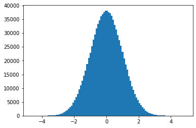
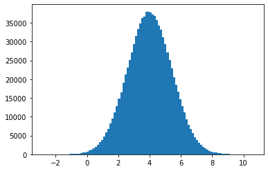
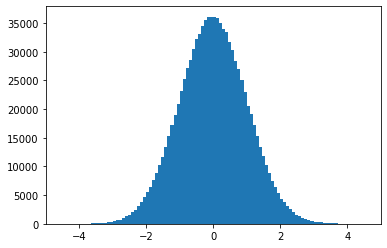
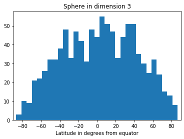
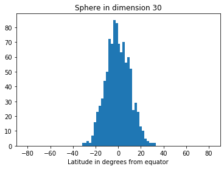
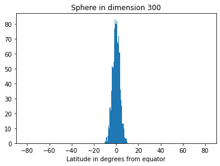
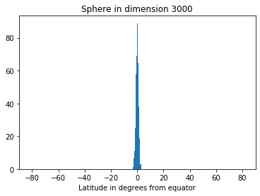
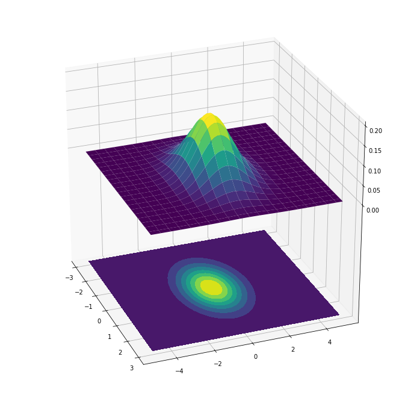
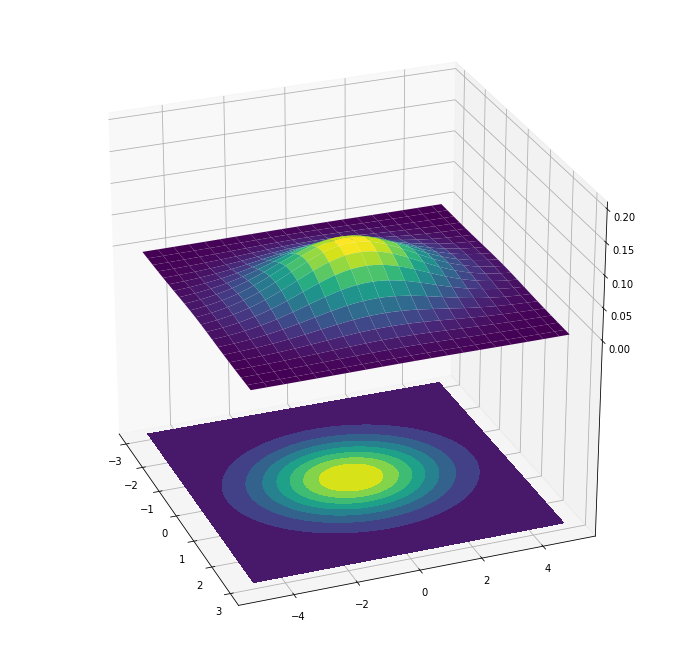
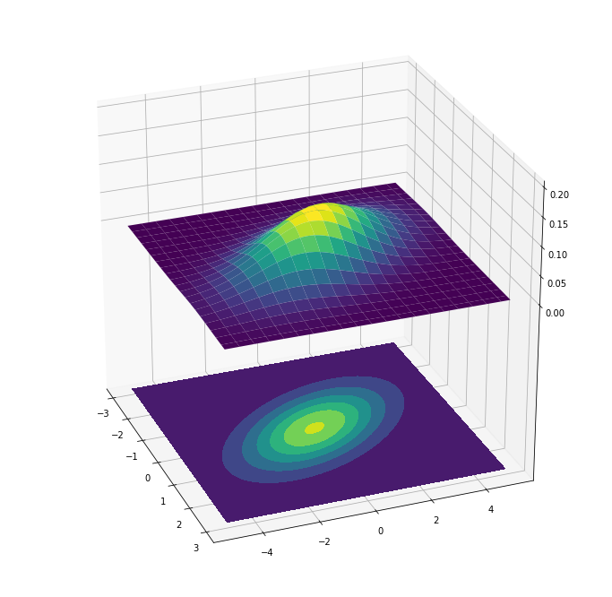

# Foundations of Data Science
## Chapter 2 : High-Dimensional Space
### Question: What is a "Zero mean, unit variance Gaussian”?

*Gaussian distribution*

[https://www.inf.ed.ac.uk/teaching/courses/mlpr/2017/notes/w2b_univariate_gaussian.pdf](https://www.inf.ed.ac.uk/teaching/courses/mlpr/2017/notes/w2b_univariate_gaussian.pdf)

Math notation:</br>

<p align="center"></p>  

<p align="center"></p>


CS notation: <p align="center">x = randn( )</p>

Function: 

<p align="center"></p>

a.k.a. Probability Density Function (PDF) for Standard Normal Distribution

The *inflection point* of the Gaussian (normal) curve is one standard deviation below the mean, and one standard deviation above the mean.

Let there be a curve with mean *μ* and standard deviation *σ*
Then inflection points occur where *x* = *μ* ± *σ*
 
 
*μ* : Mu  
*σ* : lower case sigma  

[https://www.thoughtco.com/inflection-points-of-a-normal-distribution-3126446](https://www.thoughtco.com/inflection-points-of-a-normal-distribution-3126446)

One property of the inflection point is that the second derivative of the function will be zero (however, not all points where the 2nd derivative of the function is zero, will be an inflection point).

So for a graph *y = f( x )*  
Given an inflection point at *x = a*  
Then *f’’( a )* = 0  

This can be proven using the Probability Density Function, as illustrated in the reference document above. The PDF is generally used in the context of continuous (rather than discrete) random variables. It can be used to specify the probability that a random variable falls *within a particular range of values*, as opposed to taking on a particular value (at a particular value the probability is zero).

See [https://en.wikipedia.org/wiki/Probability_density_function](https://en.wikipedia.org/wiki/Probability_density_function)

*Variance* (for continuous variables) can be expressed as:

<p align="center"></p>  

Where:  
 = variance  
 = (Individual Value – Mean)²  
   = Summation of function associated with it  
 = Total number of data points in our dataset  

This can also be expressed as: 
<p align="center"></p>  

This is relevant in the context of the Gaussian curve, however it is worth keeping in mind that the situation would be different in the case of discrete variables.

[http://zerosnones.net/variance-limitation-properties-applications/](http://zerosnones.net/variance-limitation-properties-applications/)

"*Unit variance* means that the standard deviation of a sample as well as the *variance* will tend towards 1 as the sample size tends towards infinity." This is typically referred to as the *standard normal distribution*.

For a sample of a million random values:

```
import numpy as np
from matplotlib import pyplot as plt
N = 1000000
xx = np.random.randn(N)
hist_stuff = plt.hist(xx, bins=100)
plt.show()
```



*Variance and Standard Deviation*

[https://www.quora.com/What-are-zero-mean-unit-variance-Gaussian-random-numbers](https://www.quora.com/What-are-zero-mean-unit-variance-Gaussian-random-numbers)

*Variance* and *standard deviation* have a close relationship. The *standard deviation* is simply the square root of the *variance*.

We can see this quite easily:
```
import numpy as np

a = [11,9,5,13,18,6,9,12,10,7]

mean = np.sum(a) / len(a)
sqr_dev = []
for i in a:
    sqr_dev.append(np.square(abs(mean - i)))

variance = np.sum(sqr_dev) / len(a)
std_dev = np.sqrt(variance)

print(f"mean: {mean}")
print(f"original: {a}")
print(f"squared deviations: {sqr_dev}")
print(f"variance: {variance}")
print(f"standard deviation: {std_dev}")
print(f"np variance: {np.var(a)}")
print(f"np standard deviation: {np.std(a)}")
```

```
mean: 10.0
original: [11, 9, 5, 13, 18, 6, 9, 12, 10, 7]
squared deviations: [1.0, 1.0, 25.0, 9.0, 64.0, 16.0, 1.0, 4.0, 0.0, 9.0]
variance: 13.0
standard deviation: 3.605551275463989
np variance: 13.0
np standard deviation: 3.605551275463989
```

To conclude, a “zero mean, unit variance Gaussian” is a Gaussian distribution with *µ* =0, *σ =* 1, also called a Standard Normal Distribution.

Note that the Standard Normal Distribution is simply one kind of Normal Distribution. More generally, "the *normal distribution* is a probability function that describes how the values of a variable are *distributed* ” (Wikipedia). The mean and variance could have different values, for example it could have mean 4 and variance 2, as in the following example:

```
import numpy as np
from matplotlib import pyplot as plt

x = 4 + (np.random.randn(1000000) * np.sqrt(2))

print(x.mean()
print(x.var())
print(x.std())

4.000612096576726
2.0002004340052753
1.4142844247198918

h = plt.hist(x, bins=100)
plt.show()
```



So to return to our initial function:

<p align="center">

</p>

"The factor   in this expression ensures that the total area under the curve *f* ( *x* ) is equal to one. The factor  in the exponent ensures that the distribution has unit variance (i.e., the variance is equal to one), and therefore also unit standard deviation. This function is symmetric around *x* = 0, where it attains its maximum value  and has [inflection points]() at *x* = +1 and *x* = −1.” - Wikipedia

### Question: How do you shift a distribution to zero mean?
 
 
**Answer:** Subtract the mean from (each value in) the distribution, and divide by the variance.

```
import numpy as np
from matplotlib import pyplot as plt

x = 10 + (np.random.randn(1000000))
normalised_x = (x - x.mean()) / x.std()

h = plt.hist(x, bins=100)
plt.show()
h = plt.hist(normalised_x, bins=100)
plt.show()
```




 
 
Given that in the above example the mean is ten, which we added to the dataset, and the variance should be close to 1 (unit variance), the formula is in effect simply reversing that operation: subtracting the mean, and dividing by the variance (≈1).

### Question: What is the Empirical Rule?

It is also known as the *68–95–99.7 rule* .  

It implies that 68.27%, 95.45% and 99.73% of the values lie within one, two and three standard deviations of the mean.

Mathematically it can be expressed as follows:

Pr( *µ* - 1σ ≤ *X* ≤ *µ* + 1σ ) ≈ 0.6827  
Pr( *µ* - 2σ ≤ *X* ≤ *µ* + 2σ ) ≈ 0.9545  
Pr( *µ* - 3σ ≤ *X* ≤ *µ* + 3σ ) ≈ 0.9973  

The *three-sigma rule* states that even in the case of non-normally distributed variables, 88.8% of cases will still fall within the three sigma intervals (three standard deviations from the mean). This follows from *Chebyshev’s inequality*, which will be looked at later.

The *three-sigma rule of thumb* is the observation that, for many cases (eg. in social sciences). most cases fall within three standard deviations of the mean. 

*Confidence intervals* can be calculated to provide a range of plausible values for the unknown parameter in question. The interval has an associated *confidence level.*
 
 
[https://en.wikipedia.org/wiki/68%E2%80%9395%E2%80%9399.7_rule](https://en.wikipedia.org/wiki/68%E2%80%9395%E2%80%9399.7_rule)

The Gaussian has an important property in high dimensions. If we were to generate *n* points in *d* -dimensions, and each coordinate is a zero mean, unit variance Gaussian, and *d* is sufficiently large, then the *distance* between every pair of points will be almost exactly the same, with high probability.
 
 
### Question: What is a “Unit ball”?
 
 
A *unit circle* is the set of points of distance one from a fixed central point in two dimensions, in other words a circle with radius one. A *unit sphere* is the set of points in three dimensions of distance 1 from a fixed central point, in other words a sphere with radius one. The unit sphere is also known as a *unit ball*.

Any sphere can be transformed to a unit sphere through a combination of *translation* and *scaling* (Euclidian geometric transformations).

[https://en.wikipedia.org/wiki/Unit_sphere](https://en.wikipedia.org/wiki/Unit_sphere)

The unit ball has important properties in higher dimensions.

The *volume* of a high-dimensional unit ball is concentrated near its surface and also at its equator. One consequence of this is that the set of all points *x* such that | *x* | ≤ 1 goes to zero as *d* goes to infinity.

### Question: What is the Expected Value?
 
Intuitively the expected value is simply the value that can be expected following some kind of action or event. In statistics and probability, "the *expected value* is calculated by multiplying each of the possible outcomes by the likelihood each outcome will occur and then summing all of those *values*.” - [Investopedia](https://www.investopedia.com/terms/e/expected-value.asp)

It also has a connection to the Central Limit Theorem in that the “expected value is a measure of *central tendency*; a value for which the results will tend to. When a probability distribution is normal, a plurality of the outcomes will be close to the expected value.” - [Brilliant](https://brilliant.org/wiki/expected-value/)

The simple version of the formula is for binomial events, which simply states that you multiply the probability with the number of times that the event occurs:

<p align="center"></p>  

[https://www.youtube.com/watch?v=lxYBCrrhLW0](https://www.youtube.com/watch?v=lxYBCrrhLW0)

However, this is often too simple, so we need a way to represent multiple types of events. The formula in this case looks as follows:

<p align="center"></p>  

[https://www.youtube.com/watch?v=_eIZKor-h48](https://www.youtube.com/watch?v=_eIZKor-h48)

These formulas are for discrete random variables, in other words where there are a countable number of possible values (even it is countably infinite). Each of these values have a probability between 0 and 1, and the sum of all the probabilities is equal to 1.

There is also the continuous case, and the general case. The differences between these types of random variables require a more rigorous exploration than is done in this section.

### Question: What is the Law of Large Numbers?

Informally, assuming we have a fair way of sampling, it simply means that the probability of reaching our expected value approaches 1 as the number of samples increases to infinity. A different way of putting is that the mean of the sample will approach the true mean of the population as *n* → ∞.

A simple example is the tossing of a coin. As the number of coin tosses *n* increases, the likelihood of us having tossed 50% heads and 50% tails tends towards 1. 

What it *does not mean* is that if we have a streak of heads that the probability of throwing tails suddenly increases. This is called the *Gambler’s Fallacy*. That is because the probability has no historical dependency, in other words it is *statistically independent*.    
 
[https://en.wikipedia.org/wiki/Gambler's_fallacy](https://en.wikipedia.org/wiki/Gambler's_fallacy)

There is an important distinction between the Weak and the Strong Law of Large Numbers. The Weak Law essentially says that there is no guarantee that all realised values of a random variable will fall within a given interval, in other words that the probability will be 1, but nevertheless there is a “high probability”. In the case of the Strong Law, however, we *can* say with probability 1 that the realised values will fall within the given interval because we are able to say that the values converge *almost surely*. 
 
[https://www.youtube.com/watch?v=Bn0wWZENeQI](https://www.youtube.com/watch?v=Bn0wWZENeQI)

*Weak Law:*

<p align="center"></p>  

*Strong Law:*

<p align="center"></p>  

[https://terrytao.wordpress.com/2008/06/18/the-strong-law-of-large-numbers/](https://terrytao.wordpress.com/2008/06/18/the-strong-law-of-large-numbers/)

It is important to note that for the Law of Large Numbers to apply, the size of the population does not matter. The number *n* that should be sampled out of a population so that there is at most a chance 𝛿 that the estimate is off by more than *ϵ* depends only on 𝛿 and *ϵ* and not on the overall population size.

### Question: How do you Prove the Law of Large Numbers?
 
 
You can prove it by using Chebyshev’s inequality, which in turn relies on Markov’s inequality.

Proof of Markov’s inequality: [https://www.youtube.com/watch?v=sp9RF0zH-SU](https://www.youtube.com/watch?v=sp9RF0zH-SU)

Proof of Chebyshev’s inequality: [https://www.youtube.com/watch?v=h0YH79kLuOA](https://www.youtube.com/watch?v=h0YH79kLuOA)

Proof of the Law of Large Numbers: [https://www.youtube.com/watch?v=4QAeBJVn9WI](https://www.youtube.com/watch?v=4QAeBJVn9WI)

Courtesy of Ben Lambert’s excellent Youtube channel: [https://www.youtube.com/channel/UC3tFZR3eL1bDY8CqZDOQh-w](https://www.youtube.com/channel/UC3tFZR3eL1bDY8CqZDOQh-w)

### Question: What is the Central Limit Theorem?

The Central Limit Theorem is concerned with the sampling distribution of the mean.

"The central limit theorem states that if you have a population with mean *μ* and standard deviation *σ* and take sufficiently large random samples from the population with replacement, then the distribution of the sample means will be approximately normally distributed. This will hold true regardless of whether the source population is normal or skewed, provided the sample size is sufficiently large (usually n _>_ 30). If the population is normal, then the theorem holds true even for samples smaller than 30."

[http://sphweb.bumc.bu.edu/otlt/MPH-Modules/BS/BS704_Probability/BS704_Probability12.html](http://sphweb.bumc.bu.edu/otlt/MPH-Modules/BS/BS704_Probability/BS704_Probability12.html)

Suppose:  
The mean of the sample is *x̅*  
The size of the sample is *n*  
The standard deviation of the sample is *s*  
Then there are 4 aspects:  
1. the sampling distribution of the mean will be less spread than the values in the population
2. the sampling distribution will be well modelled by a normal distribution
3. the spread of the sampling distribution is related to the spread of the population values
4. bigger samples lead to a smaller spread in the sampling distribution

### Question: How does the Law of Large Numbers reflect in high dimensions?

"The square of the distance between two points *y* and *z* can be viewed as the sum of *d* independent samples of a random variable *x* that is the *squared difference of two Gaussians*.”


Based on the Law of Large Numbers we can say that, with high probability, the sum is close to the sum’s expectation.

### Question: What is the difference between the Probability Density Function and Probability Mass Function?
 
 
Probability distribution can occur in two ways, depending on the characteristics of the random variable. If the random variable only has discrete values, the probability distribution is a Probability Mass Function (PMF) and the solution can be calculated as a weighted sum. If the random variable has continuous values, the probability is a Probability Density Function (PDF) and the solution can be calculated using an integral.
 
 
**PMF** - Probability mass function relates to the use of discrete random variables

</div>  

</div>  
 0"></div>  
</div>  

**PDF** - Probability density function relates to the use of continuous random variables

</div>  

</div>  
</div>  

 
A PDF in fact *describes* a continuous random variable. I.e. if a random variable takes values on a continuous set, that by itself isn’t enough to make it a continuous random variable.

The probability that X is any *particular* point is in fact 0 (the integral where *a* is equal to *b* is 0). A side effect of this is that the probability of a closed and open interval (one that does, and one that doesn’t include the endpoints) is identical.

*Note:* it is easy to confuse Probability with the Probability Density Function, however they are not the same. Probability density functions are not probabilities, but if *f(x)* is a probability density function, then   is a probability and thus . 

[https://math.stackexchange.com/questions/1720053/how-can-a-probability-density-function-pdf-be-greater-than-1](https://math.stackexchange.com/questions/1720053/how-can-a-probability-density-function-pdf-be-greater-than-1)


The general form of the PDF for the normal distribution is:

<p align="center">

</p>

*Note: ‘ x; µ, σ ‘* implies that *x* depends on the other two parameters.

In the standard normal distribution *µ* = 0 and *σ* = 1, so that gives the simpler version:

<p align="center">

</p>

[https://www.youtube.com/watch?v=8QFpZ3FndBc](https://www.youtube.com/watch?v=8QFpZ3FndBc)
 
 
To prove that there is a vanishingly small probability that a randomly generated point **z** in *d*-dimensions would lie in the unit ball, Blum et al use a PDF with variance set at  so that the Gaussian probability density equals one at the origin (p. 7). This relationship is explained over here:

[https://books.google.co.uk/books?id=AKuMj4PN_EMC&pg=PA131&lpg=PA131&dq=probability+%22density+at+the+origin%22&source=bl&ots=EMqkf67xBd&sig=ACfU3U0TRJIjhaLxZlpSY2eEOxz5au52JA&hl=en&sa=X&ved=2ahUKEwiQ4I64k4bqAhUTrHEKHakYBM0Q6AEwB3oECAgQAQ#v=onepage&q=probability%20%22density%20at%20the%20origin%22&f=false](https://books.google.co.uk/books?id=AKuMj4PN_EMC&amp;pg=PA131&amp;lpg=PA131&amp;dq=probability+%22density+at+the+origin%22&amp;source=bl&amp;ots=EMqkf67xBd&amp;sig=ACfU3U0TRJIjhaLxZlpSY2eEOxz5au52JA&amp;hl=en&amp;sa=X&amp;ved=2ahUKEwiQ4I64k4bqAhUTrHEKHakYBM0Q6AEwB3oECAgQAQ#v=onepage&amp;q=probability%20%22density%20at%20the%20origin%22&amp;f=false)

So, given the formula:

<p align="center">

</div>

if we set the variance to  then the probability at *x* = 0 becomes 1 because the function becomes  and 1 to the power of anything remains 1.

The argument goes:
* there is vanishingly small probability that a random point **z** in *d*-dimensions would lie in the unit ball
* this implies the integral of the probability density over the unit ball is vanishingly small
* and because the probability density in the unit ball is bounded below by a constant ...
* the unit ball must have vanishingly small volume

### Question: What is a tail bound and how do we calculate its probability?
 
 
A tail bound is the bound probability of rare events. There are many ways to calculate tail bound probabilities. There are a number of famous theorems that can calculate bounds to various levels of precision, depending on the type of information available.

These include the Markov, Chebyshev and Chernoff inequalities, as well as others like the Higher Moments, Gaussian Annulus, and Power Law theorems.

[https://courses.cs.washington.edu/courses/cse312/11au/slides/09tails.pdf](https://courses.cs.washington.edu/courses/cse312/11au/slides/09tails.pdf)

There is a more general version called the *Master Tail Bounds Theorem* from which some of these theorems can be derived.

In summary, the theorem says that given:

   , and  is iid  
Variance ≤   
*µ* = 0  
  
  

Then:
<p align="center"></p>  

It gives a much stronger bound with respect to *a* than Markov and Chebyshev, for example. Here we have an exponential drop off with respect to *a*, whereas Markov gives us  and Chebyshev gives us 

[https://medium.com/jun-devpblog/data-science-1-expectation-variance-law-of-large-numbers-2ff49caf8b7d](https://medium.com/jun-devpblog/data-science-1-expectation-variance-law-of-large-numbers-2ff49caf8b7d)

### Question: How is volume distributed in higher dimensions?
 

Volume in higher dimensions is distributed near the surface.

Consider an object *A* in *R*<sup>*d*</sup> shrunk by a small amount *𝛜*. The new object is represented by:

( 1 - *𝛜* ) *A* = { ( 1 - *𝛜* ) *x* | *x* ∈ *A* }

This means that:

volume( ( 1 - *𝛜* ) *A* ) = ( 1 - *𝛜* ) <sup>*d*</sup> volume( *A* )

Because 1 - *x* ≤ *e*<sup>*-x*</sup>, for any given object *A* in *R*<sup>*d*</sup> we get:

volume( ( 1 - *𝛜* ) *A* ) / volume( *A* ) = ( 1 - *𝛜* ) <sup>*d*</sup> ≤ *e*<sup>-*𝛜 d*</sup>
 
 
If we fix *𝛜* and *d* ⟶ ∞ then the above approaches 0. Thus the volume of *A* is in the portion not represented by ( 1 - *𝛜* ) *A*.

Given a unit ball *S* in *d*-dimensions the implication of the above is that at least 1 - *e*<sup>-*𝛜 d*</sup> of the volume of *S* is concentrated in a *d*-dimensional annulus of width *𝛜* at the perimeter. We can see that *e*<sup>-*𝛜 d*</sup> decreases rapidly as *d* increases, eg. for 𝛜 = 0.1, *d* = 3, *e*<sup>-*𝛜 d*</sup> = 0.741, and for 𝛜 = 0.1, d = 100, *e*<sup>-*𝛜 d*</sup> = 0.000045. So 1 - *e*<sup>-*𝛜 d*</sup> ⟶ 1 as *d* ⟶ ∞.

Another way of looking at it is to say that the unit ball’s volume is concentrated in a *d*-dimensional annulus of width  or  near the perimeter. Given a ball of radius *r*, the width where the volume is concentrated is .

Q: Other than the intuition that large *d* accounts for the relationship between volume and the width of the annulus, how is the leap made, exactly, to the annulus’ width ?

### Question: How do you calculate the volume of the unit ball in d dimensions?

As *d* ⟶ ∞ , the volume of the ball goes to zero. In the first few dimensions the volume goes up, up to d = 7, and then it goes down.

The volume can be calculated using integration. There is more than one way. Integration in Cartesian coordinates have complicated integral limits, so polar coordinates are preferred.

Let *V*( *d* ) is the volume of the unit ball, and *A*( *d* ) is the surface. The proof starts with:

</div>  
</div>  
 </div>  
  
 
 
But this stops integration at the surface of the sphere. To allow it to go all the way to infinity, involve an exponential in a function called *I*( *d* ). *I*( *d* ) can then be calculated in both Cartesian and polar coordinates, which yields:

</div>  

and:

</div>  

which together gives:

</div>  

That produces the lemma for the surface area *A*( *d* ) and the volume *V*( *d* ):

</div>  

and

  

Since  is an exponential in  and  grows as the factorial of , the  (as claimed at the start).

An intuitive explanation of the formula is available courtesy of Zach Star:

[https://www.youtube.com/watch?v=mXp1VgFWbKc](https://www.youtube.com/watch?v=mXp1VgFWbKc)

Note that the above steps are an oversimplification of the proof. For a more general look at a proof for the formula of the volume of a ball in higher dimensions, see:

[https://www.youtube.com/watch?v=XLq-cjwvS3M](https://www.youtube.com/watch?v=XLq-cjwvS3M)

Another example:

[https://www.usna.edu/Users/physics/mungan/_files/documents/Scholarship/HypersphereVolume.pdf](https://www.usna.edu/Users/physics/mungan/_files/documents/Scholarship/HypersphereVolume.pdf)
 
 
### Question: How is the volume of the unit ball distributed in higher dimensions?
 
 
The claim is that in high dimensions most of a unit ball's volume is concentrated near its "equator”. This is tricky to understand and not easy to visualise, partly because the 3-dimensional version seems to be atypical. One way of thinking about is that, in actual fact, the volume is distributed evenly and that one lap around the ‘equator’ passes by an increasingly larger amount of its interior, and therefore volume, as *d* ⟶ ∞. In terms of a visualisation it helps to keep in mind that a unit ball becomes ’spiky’, however with some caveats as explained by Colin Wright:

[http://www.penzba.co.uk/cgi-bin/PvsNP.py?SpikeySpheres](http://www.penzba.co.uk/cgi-bin/PvsNP.py?SpikeySpheres)

[https://news.ycombinator.com/item?id=3995615](https://news.ycombinator.com/item?id=3995615)

Blum et al puts it as follows: “most of the volume of the unit ball lies in the thin slab of points whose dot product with *v* has magnitude ”, which can be shown by fixing **v** as the first coordinate vector. From this it can be shown that, with high probability, two random points in the unit ball are nearly orthogonal. Specifically their vectors will be nearly orthogonal, they will be close to the surface, and have length . Fixing the first as “north”, the second will have a projection of , which is the same as their dot product. This means that with high probability the angle between the vectors will be .

**In summary:**

1. As *d* ⟶ ∞ , the volume of the ball goes to zero
2. A unit ball’s volume is concentrated around its ‘equator’, i.e.: 
3. The vectors of two random points in the unit ball tend to be (nearly) orthogonal
4. The vectors tend to be close to the surface, with length 
5. The angles between the vectors tend to be 

Here is an attempt to explain it intuitively:

[https://mathoverflow.net/questions/210291/how-to-explain-the-concentration-of-measure-phenomenon-intuitively](https://mathoverflow.net/questions/210291/how-to-explain-the-concentration-of-measure-phenomenon-intuitively)

But a better way to visualise it actually comes from this explanation:

[https://www.quora.com/Why-is-the-higher-the-dimension-the-less-the-hypervolume-of-a-hypersphere-inscribed-in-a-hypercube-occupy-the-hypervolume-of-the-hypercube](https://www.quora.com/Why-is-the-higher-the-dimension-the-less-the-hypervolume-of-a-hypersphere-inscribed-in-a-hypercube-occupy-the-hypervolume-of-the-hypercube)

The distribution trend can be seen in these Python generated graphs:









[https://www.johndcook.com/blog/2017/07/13/concentration_of_measure/](https://www.johndcook.com/blog/2017/07/13/concentration_of_measure/)
 
 
The theorem for volume near the equator of the unit ball goes:

For *c* ≥ 1 and *d* ≥ 3, at least a    fraction of the volume of the d-dimensional unit ball has   .

### Question: What does it mean that two coordinates are nearly orthogonal?

The theorem for near orthogonality goes:

Consider drawing n points *x*₁, *x*₂, … , *x*<sub>*n*</sub> at random from the unit ball. With probability   

1. </div>  
2.   
 
 
One way of measuring orthogonality is to calculate the squared dot product of a vector and other coordinate vectors throughout the unit ball. So for example if a random vector = (1, 0, 0, … 0), all these dot products give zero mean, with variance = , and standard deviation = . To put it differently, the expected value of any two coordinate vectors' dot products is 0, because each component of the sum is the product of two independent Gaussians with mean 0. So we can conclude that in higher dimensions the inner dot product of any two coordinate vectors is likely to be 0, with high probability.
 
 
[https://math.stackexchange.com/questions/995623/why-are-randomly-drawn-vectors-nearly-perpendicular-in-high-dimensions](https://math.stackexchange.com/questions/995623/why-are-randomly-drawn-vectors-nearly-perpendicular-in-high-dimensions)

[https://math.stackexchange.com/questions/3059747/probability-of-two-random-points-being-orthogonal-in-higher-dimensional-unit-sph](https://math.stackexchange.com/questions/3059747/probability-of-two-random-points-being-orthogonal-in-higher-dimensional-unit-sph)

### Question: How do you generate points uniformly at random from a ball?
 
 
Generating points *x*₁, *x*₂, …, *x*<sub>*d*</sub> each with coordinates an independent Gaussian variable:
   using zero mean, unit variance Gaussian, i.e.
      on the real line

Gives probability density of *x*:

  

with spherical symmetry.

Normalising vector **x** = ( *x*₁, *x*₂, …, *x*<sub>*d*</sub> ) to a unit vector 

Gives a distribution that is uniform over the sphere’s surface
*Note:* once normalised, the coordinates are no longer independent

Generating a point **y** uniformly over the unit ball volume,
we must scale the surface point  by a scalar *ρ* ∈ [0, 1] 

Gives a point:

  

*Note:* The distribution of *ρ* as a function of *r* is not uniform across the ball. Instead the density of *ρ* at distance *r* is proportional to *r*<sup>*d* - 1</sup> in *d* dimensions. Solving    we see that we should set *c* = *d*. Another way of looking at it is knowing that the density at radius *r* is exactly  . So we would want to pick *ρ*(*r*) with density equal to *dr*<sup>*d*-1</sup> for *r* over [0,1].

[https://stats.stackexchange.com/questions/85916/distribution-of-scalar-products-of-two-random-unit-vectors-in-d-dimensions](https://stats.stackexchange.com/questions/85916/distribution-of-scalar-products-of-two-random-unit-vectors-in-d-dimensions)

On a more practical note, there are a number of ways to sample from a unit ball. Rejection sampling is a common and intuitive approach, but it is not very efficient. Two of the most well known, much more efficient ways, are the Box-Muller transform and the inverse transform sampling.

The Box-Muller transform takes two uniformly distributed random numbers and derives Gaussian distributed random numbers.

[https://www.youtube.com/watch?v=EXsdT91XFAY](https://www.youtube.com/watch?v=EXsdT91XFAY)

Inverse transform sampling requires that the CDF is known, and entities have to be normalised. Most importantly it doesn’t generalise well to higher dimensional problems, due to difficulties in calculating a CDF. Unlike rejection sampling, however, it is 100% efficient.

[https://www.youtube.com/watch?v=rnBbYsysPaU](https://www.youtube.com/watch?v=rnBbYsysPaU)

This blog post discusses a variety of ways with some pseudo code that is fairly easy to implement.

[http://extremelearning.com.au/how-to-generate-uniformly-random-points-on-n-spheres-and-n-balls/](http://extremelearning.com.au/how-to-generate-uniformly-random-points-on-n-spheres-and-n-balls/)

### Question: How do Gaussians behave in Higher Dimensions?
 
 
The *d*-dimensional spherical Gaussian with zero mean and variance *σ*² has the following density function: 
 
  

Although density is maximum at origin, there is little volume. The radius needs to be increased to around √d before there is significant and hence probability mass. Beyond √d the probability density starts to drop off at a much faster rate than the volume increases.

### Question: What is the connection between random projection and the Johnson-Lindenstrauss lemma?

### Question: How do you identify which Gaussian a point belongs to when there is more than one distribution?
 
 
The algorithm is ultimately simple:
- Calculate the distance between pairs of points
- Points whose distance apart is smaller are from the same Gaussian (vs points further apart)

Firstly, from the Gaussian Annulus Theorem, which states that for large *d*, the *d*-dimensional Gaussian is located in the annulus with high probability, we can derive that for two points **x** and **y**:


If we now have two Gaussians, with centres **p** and **q**, separated by distance ∆, then if point **x** is drawn from the first and point **y** from the second Gaussian, then the distance between them will be close to  since **x** - **p**, **p** - **q**, **q** - **y** are mutually (nearly) perpendicular. It can then be show that:

  

In order to ensure that two points picked from the same Gaussian are closer to each other than two points picked from different Gaussians requires that the upper limit of the distance between a pair of points from the same Gaussian is at most the lower limit of distance between point from different Gaussians.

It can be derived from the above that spherical Gaussians can be separated this way as long as their centres are separated by *ω*( *d*¹ᐟ⁴).

Refined algorithm:
- Calculate all pairwise distances between points
- The cluster of smallest pairwise distance must be from a single Gaussian
- Remove these points
- The remaining points come from the second Gaussian

### Question: How do you fit a spherical Gaussian to data?
 
 
A quick review of PDF and CDF is in order. Remember, the PDF is the gradient of the CDF, and inversely the CDF is the integral of the PDF, a.k.a. the Area Under the Curve (AUC). The total area under the PDF equals 1 (between -∞ and ∞).

In a Gaussian distribution, the parameters we are trying to discover in a sample of data can be determined as follows:

</div>  

  
 

A distribution’s width scales with the standard deviation (not the variance). So if the two variances *σ*² = 4 and *σ*² = 1, then the width in the first distribution will be twice that in the second.

In *d* dimensions:

**µ** = ( *µ*₁, *µ*₂, … *µ*<sub>d</sub> )<sup>*T*</sup>  
**Σ** = ( *σ*ᵢⱼ ) 
i.e. **Σ** is a covariance matrix ( *d*-by-*d* square matrix) with element *σ*ᵢⱼ at row *i* and column *j*


  

Values along the leading diagonal gives the variance of each variable, and off-diagonal values measure correlations between variables.
 
 
The mean vector **µ** is the expectation of **x**:  
**µ** = *E*( **x** )

The covariance matrix **Σ** is the expectation of the deviation of **x** from the mean:

<i>E</i>[ ( **x** - **µ** ) ( **x** - **µ** )*ᵀ* ]

**Σ** = ( *σᵢⱼ* ) = **Σ**<i>ᵀ</i> is a symmetric *d x d* matrix 

Any covariance matrix is *positive semi-definite*. The same goes for its inverse, if it exists.
This means: 

**x**<i>ᵀ</i> **Σ**<i>x</i> ≥ 0 for any real valued vector **x**
 
 
*σ*ᵢⱼ is not the standard deviation, but the covariance between *i* and *j* in **x**. Eg. in the 1-dimensional case, *σ*₁₁ = *σ*².
The sign of *σᵢⱼ* (the covariance) helps to determine the relationship between two variables:
- If *xⱼ* is large when *xᵢ* is large, then ( *xⱼ* − *μⱼ* )( *xᵢ* − *μᵢ* ) will tend to be positive;
- If *xⱼ* is small when *xᵢ* is large, then ( *xⱼ* − *μⱼ* )( *xᵢ* − *μᵢ* ) will tend to be negative.
Large covariance probably implies redundant information.
On the other hand *σᵢⱼ* = 0 implies statistical independence.

The correlation coefficient, a.k.a. Pearson correlation coefficient, is a value between -1 and 1 obtained by normalising the covariance *σᵢⱼ* by the square root of the product of the variances *σᵢᵢ* and *σⱼⱼ*
 
   


Consider 2-dimensional Gaussian with:

  

  
 

The means are zero and the variances are equal. This will give a /spherical Gaussian/ that can be plotted as follows:



Consider another 2-dimensional Gaussian with:

  

  


The means are zero, but the variances are not the same. This will give an elliptical Gaussian that can be plotted as follows:



Consider another 2-dimensional Gaussian with:

  

  


The means are zero, but the variances are not the same, and the off-diagonals are non-zero. This will give an elliptical Gaussian that can be plotted as follows:



It is useful to step through the links between the probability density function, cumulative distribution function, and a spherical Guassian provided in the below notes:

[http://www.inf.ed.ac.uk/teaching/courses/inf2b/learnnotes/inf2b-learn-note08-2up.pdf](http://www.inf.ed.ac.uk/teaching/courses/inf2b/learnnotes/inf2b-learn-note08-2up.pdf)

More formally, as per Blum et al, given the sample points **x₁**, **x₂**, …, **x**<sub>*n*</sub> in *d* dimensions we want to find the spherical Gaussian that best fits these points. If *f* is the unknown Gaussian (with mean *µ* and variance *σ*² ) then the probability density for picking these points when sampling according to *f* is given by:

  

*c* is a normalising constant, the reciprocal of   
which is equivalent to   as origin can be *µ* when integrating over -∞ to ∞
and that is equal to:   

Now we are looking to find the *Maximum Likelihood Estimator* (MLE) of our unknown Gaussian *f*, in other words the *f* that maximises the above probability density.

The lemma states that ( **x₁** - **µ** )² + ( **x₂** - **µ** )² + … + ( **x**<sub>*n*</sub> - **µ** )² is minimised when **µ** is the centroid of the points **x₁**, **x₂**, …, **x**<sub>*n*</sub> , in other words:

  

To then calculate the MLE of *σ*² for *f*, set **µ** as true centroid and *σ* as standard deviation of the sample, and substitute  and *a* = ( **x₁** - **µ** )² + ( **x₂** - **µ** )² + … + ( **x**<sub>*n*</sub> - **µ** )² into the formula for picking probability density. We can then go on to show that the maximum occurs when   .

This produces the following lemma:

“The maximum likelihood spherical Gaussian for a set of samples is the Gaussian with centre equal to the sample mean and standard deviation equal to the standard deviation of the sample from the true mean.” - Blum et al

### Question: What is the difference between the Standard error and Standard deviation?

Standard deviation quantifies the variation within a set of measurements.
Standard error quantifies the variation of the means of multiple sets of measurements.

[https://www.youtube.com/watch?v=A82brFpdr9g](https://www.youtube.com/watch?v=A82brFpdr9g)
